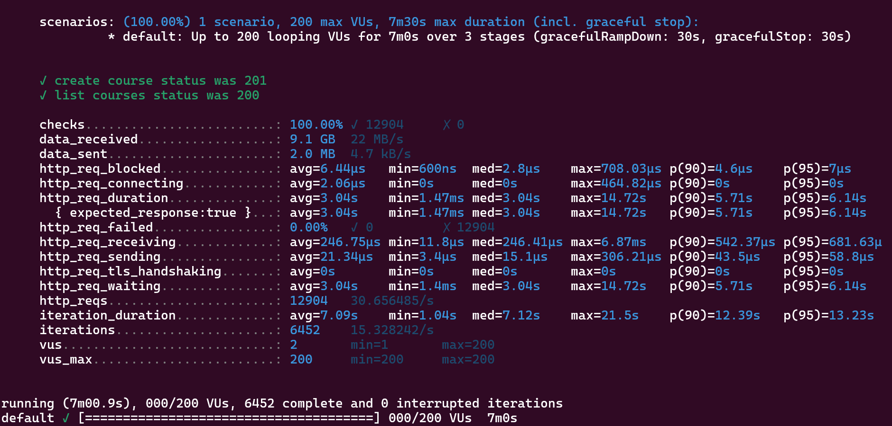

# Load Testing with K6

## Load Testing

Performance tests and stress tests are both types of load testing but they focus on different aspects of system behavior.

### Performance Tests
Performance tests are designed to assess how well a system performs under a given load. The goal is to determine the responsiveness, throughput, reliability, and scalability of a system under normal and peak conditions. These tests are usually conducted within the expected workload to ensure the system meets the performance requirements.

### Stress Tests
Stress tests push the system beyond its normal operational capacity, often to the breaking point, to observe how it behaves under extreme conditions. The goal is to identify the system's breaking point, monitor how it fails, and ensure it can recover gracefully.

## Steps for this exercice

### 1. Execute the load test

k6 run --out json=results.json load-test.js

results.json can be imported by other tools. K6 also supports stream to an external service.
More about Results Output:

https://grafana.com/docs/k6/latest/get-started/results-output/

### 2. Results:

